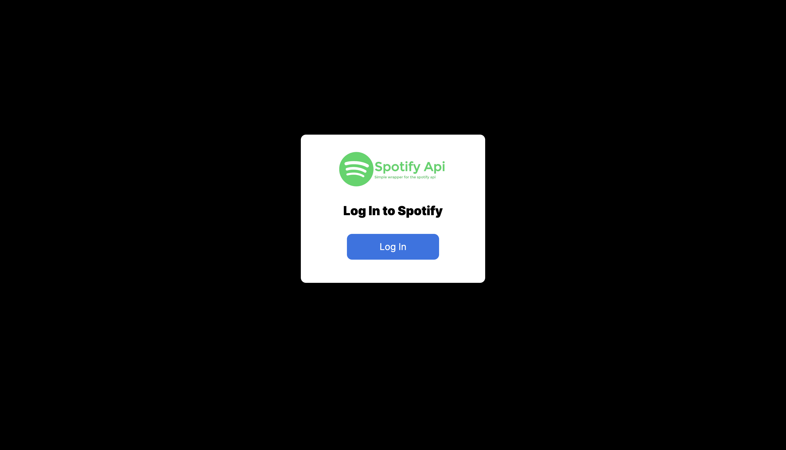
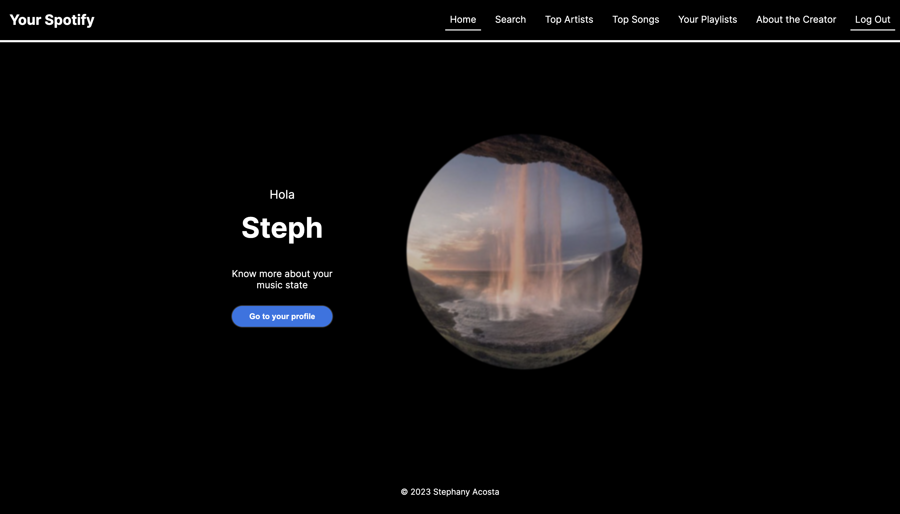
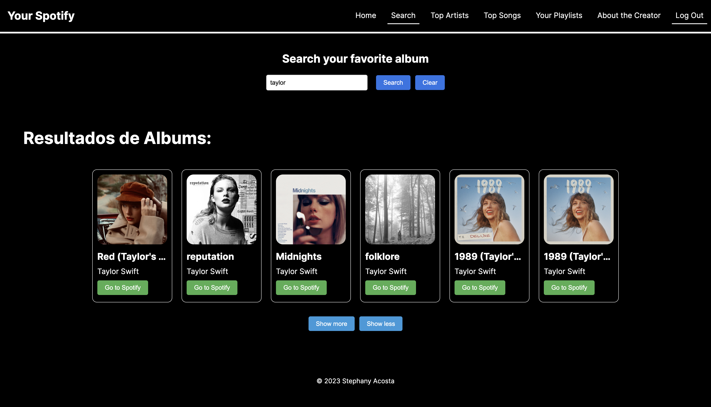
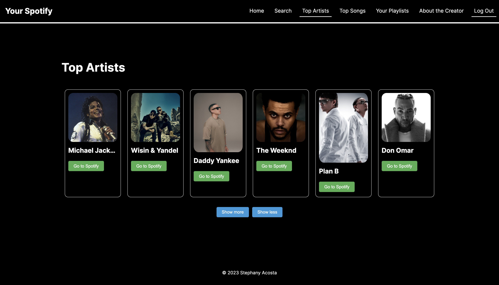
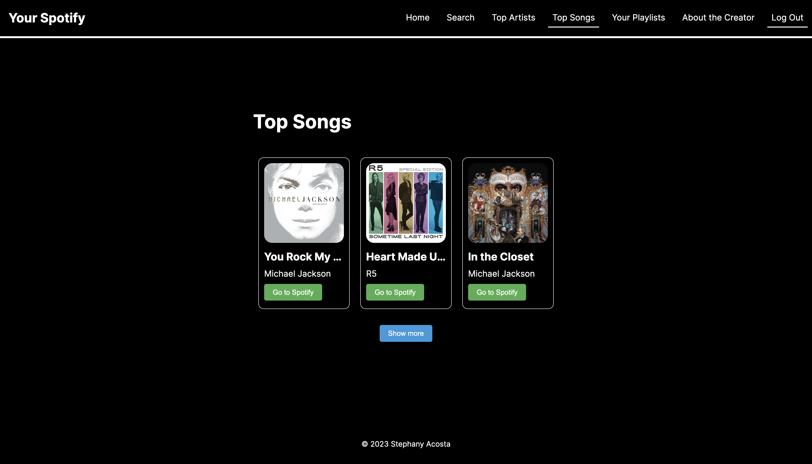
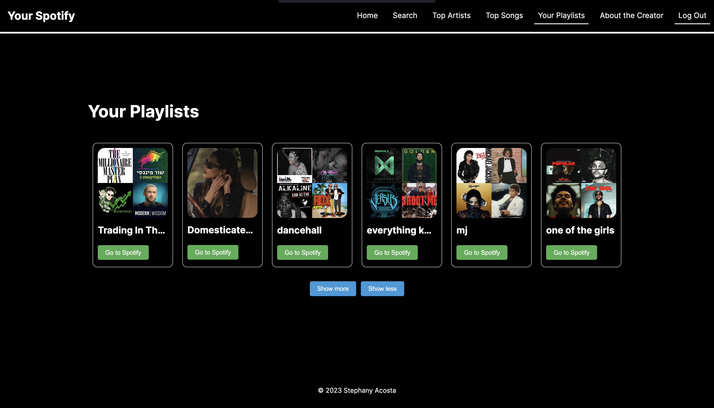
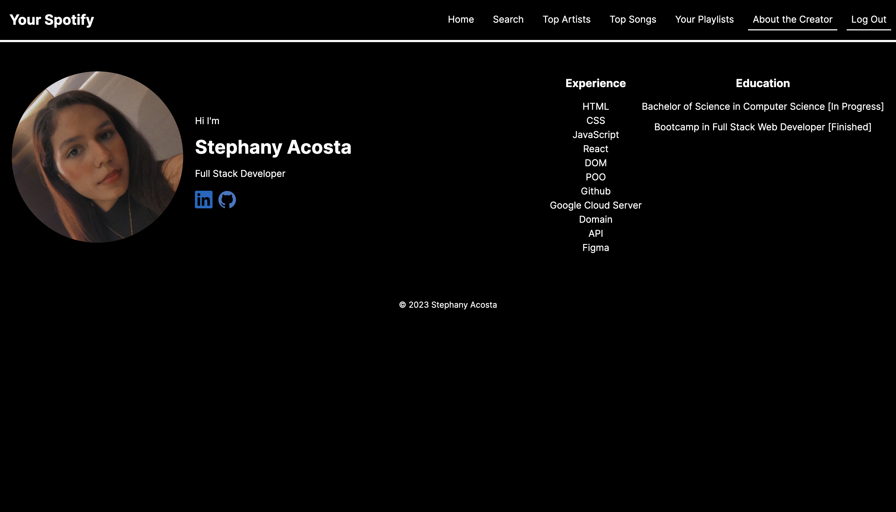

# Your Music Taste - React Frontend Application

<div align="center">
  
</div>

## 📌 Overview

A modern, full-featured React application that integrates with the Spotify API to provide a personalized music exploration experience. This app allows users to authenticate with their Spotify account, browse their top artists and songs, search for albums, and access their playlists—all within a clean, responsive interface.

## ✨ Features

- **Spotify Authentication**: Secure OAuth 2.0 flow for user login
- **Music Discovery**:
  - Browse your top artists
  - View your favorite songs
  - Search for albums by artist name
- **Personal Library**:
  - Access your curated playlists
  - View user profile and music preferences
- **Seamless Integration**: Direct links to open content in Spotify
- **Responsive Design**: Optimized for both desktop and mobile devices

## 🖼️ Screenshots

<div align="center">
  <table>
    <tr>
      <td></td>
      <td></td>
    </tr>
    <tr>
      <td></td>
      <td></td>
    </tr>
    <tr>
      <td></td>
      <td></td>
    </tr>
  </table>
</div>

## 🛠️ Technologies Used

- **Frontend**: React.js
- **API Integration**: Spotify Web API
- **Styling**: Custom CSS with dark theme
- **Authentication**: OAuth 2.0
- **Languages**: JavaScript, HTML5, CSS3

## 🚀 Getting Started

### Prerequisites
- npm (v6.x or later)
- Spotify account
- Spotify Developer account

### Installation

1. **Clone the repository**
   ```bash
   git clone https://github.com/stephanyacosta/your-spotify.git
   cd your-spotify
   ```

2. **Install dependencies**
   ```bash
   npm install
   ```

3. **Set up Spotify Developer credentials**
   - Go to [Spotify Developer Dashboard](https://developer.spotify.com/dashboard/)
   - Create a new application
   - Add `http://localhost:3000` as a Redirect URI
   - Copy your Client ID

4. **Configure environment variables**
   Create a `.env` file in the root directory:
   ```
   REACT_APP_SPOTIFY_CLIENT_ID=your_client_id_here
   REACT_APP_REDIRECT_URI=http://localhost:3000
   ```

5. **Start the development server**
   ```bash
   npm start
   ```

6. **Open your browser and navigate to:**
   ```
   http://localhost:3000
   ```

## 📱 How to Use

1. Click "Log In" on the welcome screen
2. Authorize the app with your Spotify account
3. Explore your music profile:
   - View personalized stats on the home page
   - Search for albums using the search feature
   - Browse your top artists and songs
   - Access your playlists

## 🔑 Authentication Flow

The application uses Spotify's OAuth 2.0 authentication flow:
1. User initiates login
2. User is redirected to Spotify's authorization page
3. User grants permissions to the app
4. Spotify redirects back to the application with an access token
5. The app uses the token to make API requests on behalf of the user

© 2023 Stephany Acosta
